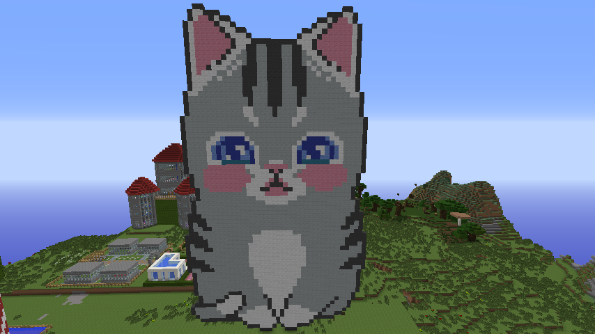
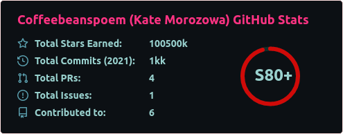
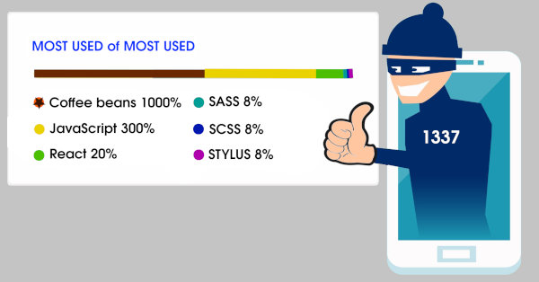

<h1 align="center">Hello cuties, I'm Kate!</h1>
<h3 align="center">I'm graphic designer from Perm (Russia) and frontend React developer</h3>

<ul>
  <li style="font-size: 38px">⚛️ Photoshop + CorelDraw my favorite tools for daily use</li>
  <li style="font-size: 38px">⚛️ JavaScript and React are the best and only one I've head learned from programming</li>
  <li style="font-size: 38px">⚛️ HTML, CSS (SASS+SCSS) using a lot </li>
  <li style="font-size: 38px">😄 Love 3D Studio Max and Archicad </li>
  <li style="font-size: 38px">🌱 Dreamer</li>
</ul>
<h3 align="left">My Stack Skills</h3>

<h3 align="left">Languages and Tools:</h3>

<h3 align="left">Connect:</h3>

`version 0.0.1`
